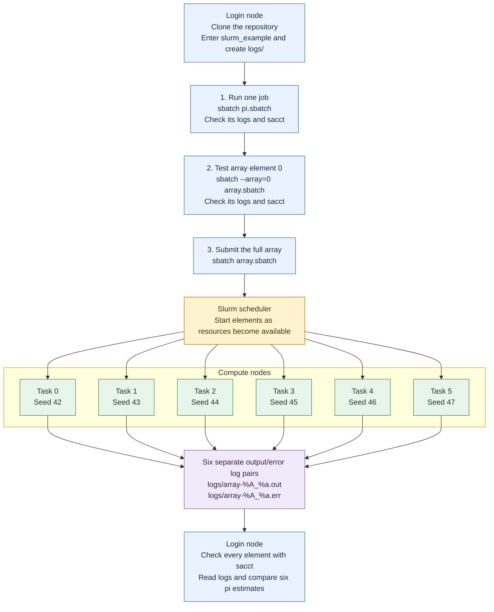

# Slurm demo files

These files accompany [Learn Slurm on FarmShare](../slurm.md). Estimate π by drawing random points in a unit square and counting the fraction inside a quarter circle: `pi ≈ 4 * inside / samples`. First run one simulation, then use a job array to repeat it with six random seeds and compare accuracy. The programs use Python 3's standard library and need no additional packages. Submit them from a Slurm cluster's login node.

- [estimate_pi.py](estimate_pi.py) estimates π and reports its absolute error against `math.pi`.
- [pi.sbatch](pi.sbatch) submits one million samples with random seed 42.
- [seeds.txt](seeds.txt) contains seeds 42–47, one per line.
- [array_pi.py](array_pi.py) selects a seed using `SLURM_ARRAY_TASK_ID` and reuses the same simulation function.
- [array.sbatch](array.sbatch) submits indexes 0–5, allowing all six elements to run concurrently when resources are available.
- `logs/` receives output and error files. Its `.gitignore` preserves the directory in the repository and excludes generated logs.

## Workflow at a glance

Submit jobs and check results from the login node. Slurm runs the simulations on compute nodes. Verify the single job and the one-element test before submitting the full array.



Each array element runs `array_pi.py`, selects its seed from `seeds.txt`, and calls the shared simulation in `estimate_pi.py`, using one CPU to draw one million points. All six elements can run concurrently; their start times depend on Slurm, and multiple elements may share a compute node. Each produces its own estimate for you to compare. In log filenames, `%A` is the parent array ID and `%a` is the element index.

## Get the files on FarmShare

From your laptop, replace `SUNetID` with your username and connect:

```bash
ssh SUNetID@login.farmshare.stanford.edu
```

See the [full tutorial](../slurm.md#2-connect-and-download-the-examples) for first-login setup and browser access. On the login node:

```bash
cd ~
git clone https://github.com/TianyuDu/ICME_Computing_Refresher_2026.git
cd ICME_Computing_Refresher_2026/slurm_example
mkdir -p logs
python3 --version
```

If you already have a checkout, skip cloning and enter its `slurm_example/` directory. For a ZIP download, extract it on the cluster and enter the same folder.

**Submit from this directory.** The scripts find their programs, inputs, and `logs/` relative to the submission directory. Create `logs/` before submitting. Both jobs request one node, one task, one CPU, 1 GiB of memory, and two minutes per job or array element.

The six-element array requests up to six CPUs and 6 GiB concurrently. Slurm decides when each element starts based on available resources and cluster limits.

These scripts target FarmShare's `normal` partition. On another Slurm cluster, adjust the partition in both `.sbatch` files and any required account or QoS settings according to your site's instructions. Python 3 and the demo files must be available on compute nodes.

## Run one job

```bash
sbatch pi.sbatch
```

Record the ID from `Submitted batch job ...`. Replace `123456` with that ID:

```bash
job_id=123456
squeue -u "$USER"
```

After it finishes:

```bash
sacct -j "$job_id" --format=JobID,State,ExitCode,Elapsed
cat "logs/pi-${job_id}.out"
cat "logs/pi-${job_id}.err"
```

Expect a compute hostname followed by:

```text
seed=42 samples=1000000 pi=3.140592 abs_error=0.001001
```

Look for a `COMPLETED` state with exit code `0:0` and no unexpected errors in the `.err` log. `abs_error` is the numerical difference from π; a nonzero value is expected for this simulation. Queue disappearance alone does not prove success, and accounting may appear after a short delay.

## Test one array element

```bash
sbatch --array=0 array.sbatch
```

Replace `123457` with the returned ID. After it finishes:

```bash
smoke_id=123457
sacct -j "$smoke_id" --format=JobID,State,ExitCode
cat "logs/array-${smoke_id}_0.out"
cat "logs/array-${smoke_id}_0.err"
```

Expect `task=0 seed=42 samples=1000000 pi=3.140592 abs_error=0.001001` and the same successful outcome as above. The command-line option runs only element 0 without changing the script. Its estimate matches the single job because both use seed 42 and one million samples.

## Run the full array

After the one-element test succeeds:

```bash
sbatch array.sbatch
```

Replace `123458` with the new parent array ID:

```bash
array_id=123458
squeue -r -j "$array_id"
```

After all elements finish:

```bash
sacct -j "$array_id" --format=JobID,State,ExitCode
cat logs/array-${array_id}_*.out
cat logs/array-${array_id}_*.err
```

Check that every element completed successfully and produced its expected result:

```text
task=0 seed=42 samples=1000000 pi=3.140592 abs_error=0.001001
task=1 seed=43 samples=1000000 pi=3.139776 abs_error=0.001817
task=2 seed=44 samples=1000000 pi=3.138120 abs_error=0.003473
task=3 seed=45 samples=1000000 pi=3.141224 abs_error=0.000369
task=4 seed=46 samples=1000000 pi=3.139116 abs_error=0.002477
task=5 seed=47 samples=1000000 pi=3.140300 abs_error=0.001293
```

These results assume the supplied seeds, sample count, and code. Each submission has a new ID and distinct log filenames. Keep the code and seed list unchanged while jobs are queued or running. If you reconnect, return to this directory and restore your job-ID variables from your notes.

## Explore the experiment

After the earlier jobs finish, change `--samples` in `pi.sbatch` to `100000` and submit it again. Compare its accuracy with the one-million-sample run while holding the seed fixed. The array's sample count is set separately in `array.sbatch`.

The full tutorial also shows how to add seed 48 and submit a seventh array element. Different seeds produce different estimates; a fixed seed and sample count make each run reproducible.

Continue with the tutorial's [practice exercises](../slurm.md#6-practice-on-your-own), [cancellation instructions](../slurm.md#know-how-to-stop-a-job), and [troubleshooting](../slurm.md#troubleshooting).
